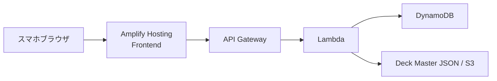
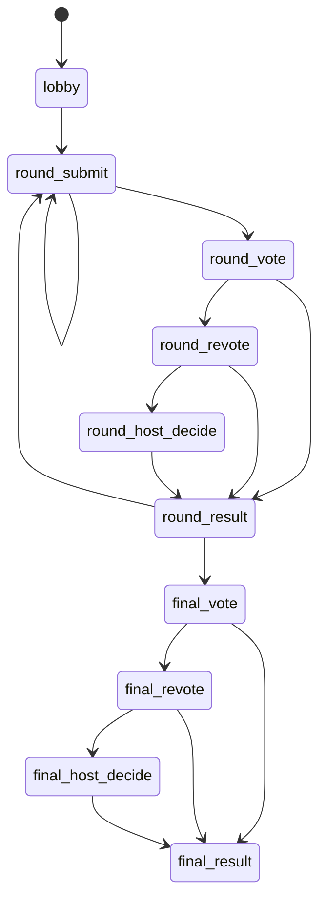

# おもじゃん 基本設計書

## 1. この文書の目的

この文書は、`要件をどう実装に落とすか` を決めるための文書です。

初版では、次の 4 点を中心に設計します。

- フロントエンド構成
- バックエンド / AWS 構成
- ゲーム状態の持ち方
- API とデータモデル

詳細は次の文書を参照します。

- `omojan_api_spec.md`
- `omojan_dynamodb_design.md`

## 2. システム全体方針

初版は `少人数・ターン制・低コスト` を優先し、次の構成を採用します。

- フロント公開: `AWS Amplify Hosting`
- API: `Amazon API Gateway`
- アプリ処理: `AWS Lambda`
- 状態保存: `Amazon DynamoDB`
- マスターデータ配布: `リポジトリ内 JSON` または `S3`

### 採用理由

- 常時起動サーバーを持たず、コストを抑えやすい
- GitHub 連携でフロントを継続デプロイできる
- 少人数のターン制ゲームに十分

## 3. アーキテクチャ概要



### 3-1. 実装の進め方

実装は次の順で進めます。

1. `backend/mock_api`
   - ローカルで画面と API 契約を固める
2. `backend/lambda/api`
   - Lambda / API Gateway の入口を固める
3. `DynamoDB 接続`
   - room / invite / deck / champions を永続化する

つまり、`ローカル mock -> Lambda 雛形 -> DynamoDB 本実装` の順で寄せます。

## 4. フロントエンド設計方針

### 4-1. 画面状態の考え方

本実装では、サーバーは `screen` ではなく `phase` を持ちます。

- `phase`
  - ルーム全体が今どの段階にいるか
- `screen`
  - 各プレイヤーの画面で何を表示するか

つまり、

`server phase -> client screen`

で画面を導出します。

### 4-2. フロントが持つ状態

クライアントは主に次の 2 種類を持ちます。

- `server state`
  - API から取得したルーム状態
- `local ui state`
  - ポップアップ開閉や提出前ドラフトの一時状態

### 4-3. フロントだけが持つ一時状態

- 選択中の牌
- 選択中の改行モード
- 手動改行位置
- 選択中の書体
- 提出ポップアップの開閉状態
- 総合優勝ポップアップの開閉状態

これらはサーバーに逐一保存しません。  
ただし `提出確定` 時点で必要な情報はサーバーへ送ります。

## 5. ゲーム状態モデル

### 5-1. ルーム全体

```ts
type RoomState = {
  roomId: string;
  inviteCode: string;
  status: "lobby" | "playing" | "finished";
  hostPlayerId: string;
  playerCount: 2 | 3 | 4;
  playerOrder: string[];
  startPlayerId: string;
  createdAt: string;
  updatedAt: string;
  game: GameState;
};
```

### 5-2. ゲーム状態

```ts
type GamePhase =
  | "lobby"
  | "round_submit"
  | "round_vote"
  | "round_revote"
  | "round_host_decide"
  | "round_result"
  | "final_vote"
  | "final_revote"
  | "final_host_decide"
  | "final_result";

type GameState = {
  phase: GamePhase;
  roundIndex: 0 | 1 | 2;
  currentTurnPlayerId: string | null;
  players: PlayerState[];
  deck: DeckState;
  rounds: RoundState[];
  finalVote: FinalVoteState | null;
  champion: WinnerState | null;
};
```

### 5-3. プレイヤー

```ts
type PlayerState = {
  playerId: string;
  displayName: string;
  isHost: boolean;
  joinedAt: string;
  isConnected: boolean;
};
```

### 5-4. デッキ / 手牌

初版では `1 デッキ固定` を前提にします。  
ただし、その 1 デッキの中身は運営側が編集・更新・削除できるようにします。

デッキ更新時の扱いは次の通りです。

- 新しく開始するルームは最新の `deckVersion` を使う
- 既に開始済みのルームは、開始時点の `deckVersion` と `initialHands` を保持する
- そのため、進行中の試合が途中で壊れない

```ts
type DeckState = {
  deckId: string;
  tileWords: string[];
  initialHands: Record<string, HandTile[]>;
  version: number;
  updatedAt: string;
};

type HandTile = {
  tileId: string;
  text: string;
};
```

### 5-5. 各ラウンド

```ts
type RoundState = {
  roundIndex: 0 | 1 | 2;
  submissions: Record<string, SubmissionState>;
  votes: Record<string, string>;
  revotes: Record<string, string>;
  hostDecision: string | null;
  winner: WinnerState | null;
};

type SubmissionState = {
  playerId: string;
  tileIds: [string, string];
  tileOrder: [0 | 1, 0 | 1];
  phrase: string;
  fontId: string;
  lineMode: "boundary" | "manual" | "single";
  manualBreaks: number[];
  renderedLines: string[];
  submittedAt: string;
};

type WinnerState = {
  playerId: string;
  displayName: string;
  phrase: string;
  fontId: string;
  renderedLines: string[];
  voteCount: number;
  source: "initial" | "revote" | "host_decide";
};
```

### 5-6. 最終投票

```ts
type FinalVoteState = {
  candidates: FinalCandidate[];
  votes: Record<string, string>;
  revotes: Record<string, string>;
  hostDecision: string | null;
  winner: WinnerState | null;
};

type FinalCandidate = {
  candidateId: string;
  roundIndex: 0 | 1 | 2;
  playerId: string;
  displayName: string;
  phrase: string;
  fontId: string;
  renderedLines: string[];
};
```

## 6. phase と画面の関係

### 6-1. 導出ルール

- `phase = lobby`
  - 全員ロビー
- `phase = round_submit`
  - 自分が手番かつ未提出 -> 提出画面
  - それ以外 -> 待機画面
- `phase = round_vote`
  - 未投票 -> 投票画面
  - 投票済み -> 待機画面
- `phase = round_revote`
  - 未再投票 -> 再投票画面
  - 再投票済み -> 待機画面
- `phase = round_host_decide`
  - ホスト -> ホスト裁定画面
  - それ以外 -> 待機画面
- `phase = round_result`
  - 全員ラウンド結果画面
- `phase = final_vote / final_revote / final_host_decide / final_result`
  - 上と同じ考え方

### 6-2. なぜこの形にするか

- 画面名をサーバーが直接持つと分岐が増えやすい
- プレイヤーごとに同じ phase でも見える画面が違う
- バックエンドの責務を `ゲーム進行` に限定できる

## 7. phase 遷移



## 8. データ保存方針

### 8-1. DynamoDB に保存するもの

- RoomState
- プレイヤー一覧
- 初期手札
- 各ラウンドの提出内容
- 投票 / 再投票 / ホスト裁定
- 総合優勝
- 優勝ワード履歴
- 再接続用のプレイヤー識別子

### 8-2. DynamoDB に保存しないもの

- ポップアップ開閉
- 牌を押している途中の状態
- プレビュー中の未確定の改行
- 書体選択途中の状態

## 9. API 設計

詳細は `omojan_api_spec.md` を参照します。ここでは方針だけを記載します。

MVP では `1 アクション = 1 API` を原則にします。

### 9-1. ルーム系

- `POST /rooms`
  - ルーム作成
- `POST /rooms/{roomId}/join`
  - 参加
- `GET /rooms/{roomId}`
  - ルーム状態取得
- `POST /rooms/{roomId}/start-player`
  - 開始順設定
- `POST /rooms/{roomId}/start`
  - ゲーム開始

### 9-2. ゲーム進行系

- `POST /rooms/{roomId}/rounds/{roundIndex}/submit`
  - ワード提出
- `POST /rooms/{roomId}/rounds/{roundIndex}/vote`
  - 投票
- `POST /rooms/{roomId}/rounds/{roundIndex}/revote`
  - 再投票
- `POST /rooms/{roomId}/rounds/{roundIndex}/host-decision`
  - ホスト裁定

### 9-3. 最終投票系

- `POST /rooms/{roomId}/final-vote`
  - 最終投票
- `POST /rooms/{roomId}/final-revote`
  - 最終再投票
- `POST /rooms/{roomId}/final-host-decision`
  - 最終ホスト裁定

### 9-4. 履歴系

- `GET /champions/recent`
  - 最近の優勝ワード一覧

### 9-5. 再接続 / セッション系

- `POST /rooms/{roomId}/reconnect`
  - 同じ端末・同じブラウザからの復帰

### 9-6. デッキ管理系

- 初版ではプレイヤー向け API としては公開しない
- 運営側は `JSON 更新 + 再デプロイ` または `S3 上のマスターデータ更新` で管理する

## 10. 同期方式

初版は `リアルタイム常時接続` ではなく、次の方式で十分です。

- 操作成功後に最新状態を再取得
- 待機画面では短周期で状態を取得

### 初版の想定

- 送信後即時再取得
- 待機画面では 3〜5 秒おきに取得

この方式なら、WebSocket を使わずに初版を成立させやすいです。

## 11. 再接続方針

初版では `同じ端末・同じブラウザ` からの復帰を対象にします。

- 初回参加時にプレイヤー識別子を発行する
- 識別子はブラウザのローカル保存領域に保持する
- 再訪時に `roomId + player token` で復帰可否を判定する
- 別端末からの乗り換えは初版では対象外

## 12. 権限制御

### ホストのみ

- 最初の順番を設定
- ゲーム開始
- ホスト裁定
- 最終ホスト裁定
- 次のラウンドへ進める
- 最終投票へ進める
- もう一度最初からを実行する

### 全員

- 参加
- 提出
- 投票
- 再投票
- 状態取得
- 同じ端末から再接続

## 13. AWS 構成詳細

### 初版構成

- `Amplify Hosting`
  - フロント公開
- `API Gateway`
  - HTTPS API
- `Lambda`
  - ゲーム進行ロジック
- `DynamoDB`
  - ルーム状態 / 履歴保存

### 今は使わないもの

- EC2
- RDS
- NAT Gateway
- 常時接続前提の複雑なリアルタイム基盤

## 14. 初版での実装方針

- まずは固定デッキ
- ログインなし、招待 URL + 表示名方式
- 造語提出 UI と結果の見せ方を最優先
- 2〜4人を同じ設計で扱う
- 画面を直接状態として持たず、phase から導出する
- 再接続は同じ端末・同じブラウザを対象にする
- デッキ管理は運営側メンテナンスで始める

## 15. 今後の拡張

- デッキ切り替え
- 認証
- リマッチ
- WebSocket での高速同期
- ホスト離脱時の権限移譲
- 管理画面
