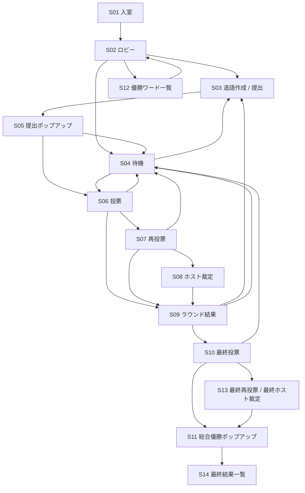

# おもじゃん 画面要件・画面遷移書

## 1. この文書の目的

この文書は、各画面で `何を見せるか` `何を操作できるか` `どこへ遷移するか` を整理するための文書です。

## 2. 画面設計の原則

- スマホ縦画面を基準にする
- 1画面に情報を詰め込みすぎない
- 重要度は `ワード > 人名 > 補足情報` とする
- 提出時の見せ場と結果時の勝利ワード表示を最優先とする
- 同じ情報を別の場所で重複して大きく見せない

## 3. 画面一覧

### S01. 入室 / 表示名入力

- 目的
  - 招待 URL からルームへ入る
- 主表示
  - ルーム名またはルームコード
  - 表示名入力欄
  - 参加ボタン
- 主操作
  - 表示名を入力する
  - ルームへ参加する
- 遷移
  - 参加成功 -> `S02. ロビー`

### S02. ロビー

- 目的
  - メンバー確認と開始準備
- 主表示
  - 参加者一覧
  - 自分 / ホスト表示
  - 招待 URL コピー
  - 最初の順番選択
  - 最近の総合優勝ワード 5 件
- 主操作
  - 招待 URL をコピー
  - 最初の順番を決める
  - 優勝ワード一覧を開く
  - ゲーム開始
- 遷移
  - ゲーム開始 -> `S03` または `S04`
  - 優勝ワード一覧 -> `S12. 優勝ワード一覧`

### S03. 造語作成 / 提出

- 目的
  - 自分の手番で造語を作る
- 主表示
  - 現在局表示
  - 提出プレビュー
  - 手牌一覧
  - 改行モード
  - 手動改行 UI
  - 書体プリセット
  - 提出ボタン
- 主操作
  - 牌を 2 枚選ぶ
  - 順番を入れ替える
  - 改行モードを選ぶ
  - 手動改行を設定する
  - 書体を選ぶ
  - 提出する
- 遷移
  - 提出直後 -> `S05. 提出ポップアップ`

### S04. 待機

- 目的
  - 他プレイヤーの手番または投票完了後の待機
- 主表示
  - 現在のフェーズ
  - 今だれの手番か、または投票待ちか
  - 進行状況
  - 必要に応じて自分の提出済みワード
- 主操作
  - なし
- 遷移
  - 自分の手番が来たら -> `S03. 造語作成 / 提出`
  - 全員提出後 -> `S06. 投票`
  - 全員投票後 -> `S09. ラウンド結果`

### S05. 提出ポップアップ

- 目的
  - 提出したワードを全員に印象的に見せる
- 主表示
  - 提出者名
  - 造語
  - 選択済みの改行 / 書体を反映した見た目
- 主操作
  - 次へ進む
- 遷移
  - 自分以外の手番が残っている -> `S04. 待機`
  - 最後の提出なら -> `S06. 投票`

### S06. 投票

- 目的
  - ラウンド勝者を選ぶ
- 主表示
  - 投票候補一覧
  - 各候補のワード表示
  - 投票禁止の自分ワード
- 主操作
  - 候補を選ぶ
  - 投票確定
- 遷移
  - 投票確定後 -> `S04. 待機`
  - 全員の投票確定後
    - 単独1位 -> `S09. ラウンド結果`
    - 同率 -> `S07. 再投票`

### S07. 再投票

- 目的
  - 同率候補の再選定
- 主表示
  - 同率候補一覧
  - 候補ワード表示
- 主操作
  - 候補を選ぶ
  - 再投票確定
- 遷移
  - 再投票確定後 -> `S04. 待機`
  - 全員の再投票確定後
    - 単独1位 -> `S09. ラウンド結果`
    - 同率 -> `S08. ホスト裁定`

### S08. ホスト裁定

- 目的
  - 再投票でも同率のときに勝ちワードを決める
- 主表示
  - 同率候補一覧
  - 候補ワード表示
  - 確定ボタン
- 主操作
  - ホストが候補を選ぶ
  - 確定する
- 遷移
  - ホスト確定後 -> `S09. ラウンド結果`
  - 非ホストは `S04. 待機`

### S09. ラウンド結果

- 目的
  - そのラウンドの勝者を発表する
- 主表示
  - 勝利ワード
  - 勝者表示名
  - 票数
  - 票数内訳
  - ここまでのラウンド勝利数
- 主操作
  - 次のラウンドへ
  - 最終投票へ
- 遷移
  - ラウンド 1, 2 -> `S03` または `S04`
  - ラウンド 3 -> `S10. 最終投票`

補足:

- `次のラウンドへ` と `最終投票へ` はホストのみ操作できる
- 非ホストは待機表示にする

### S10. 最終投票

- 目的
  - 総合優勝候補から 1 ワードを選ぶ
- 主表示
  - 各ラウンド勝利ワード
  - ラウンド表示
  - 表示名
- 主操作
  - 候補を選ぶ
  - 投票確定
- 遷移
  - 投票確定後 -> `S04. 待機`
  - 全員の投票確定後
    - 単独1位 -> `S11. 総合優勝ポップアップ`
    - 同率 -> `S13. 最終再投票`

### S11. 総合優勝ポップアップ

- 目的
  - 総合優勝ワードを最大限目立たせて発表する
- 主表示
  - `総合優勝`
  - 優勝ワード
  - 優勝者表示名
  - 裏面から表面へのめくり演出
- 主操作
  - 結果一覧を見る
- 遷移
  - `S14. 最終結果一覧`

### S12. 優勝ワード一覧

- 目的
  - 全体共通の過去の総合優勝ワードを見る
- 主表示
  - 履歴一覧
  - ワード
  - 勝者名
- 主操作
  - 閉じる
- 遷移
  - `S02. ロビー`

### S13. 最終再投票 / 最終ホスト裁定

- 目的
  - 最終投票の同率解消
- 主表示
  - 同率候補
  - 候補ワード
- 主操作
  - 再投票、またはホスト裁定
- 遷移
  - 単独1位決定 -> `S11. 総合優勝ポップアップ`

### S14. 最終結果一覧

- 目的
  - 1試合の結果を一覧で確認する
- 主表示
  - 総合優勝
  - 各ラウンド勝利ワード
- 主操作
  - もう一度最初から
- 遷移
  - `S02. ロビー` または新規試合

補足:

- `もう一度最初から` はホストのみ操作できる
- 非ホストは待機表示にする

## 4. 画面遷移の全体図

## 5. 画面ごとの役割差分

### ホストだけができること

- ロビーで最初の順番を決める
- ゲームを開始する
- ホスト裁定で勝ちワードを確定する
- 最終ホスト裁定で総合優勝を確定する

### 全員ができること

- 参加する
- 自分の手番で提出する
- 投票する
- 再投票する
- 結果を見る
- 同じ端末・同じブラウザから再接続する

## 6. UI の重要ポイント

- 提出画面では `選択中の 2 牌` を別枠で重複表示しない
- 提出ポップアップはスクロール位置に依存せず中央固定で出す
- ラウンド結果と最終結果では `勝利ワード > 表示名 > 補足情報` の順で強調する
- 総合優勝ポップアップは提出ポップアップより派手にする
