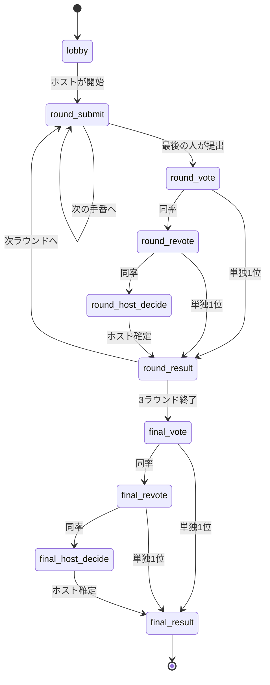

# おもじゃん ゲーム状態と画面遷移

このメモは、`おもじゃん` を試作から本実装へ進めるための土台です。

大事なのは次の 2 つを分けることです。

- `ゲーム状態`: サーバーが正として持つもの
- `画面状態`: そのゲーム状態を見て、各プレイヤーの画面でどう見せるか

この分け方にしておくと、AWS 側の実装でもフロント実装でも迷いにくくなります。

## 1. まず結論

本実装では、サーバーは `screen` ではなく `phase` を持つべきです。

- `screen`
  - 画面そのもの
  - プレイヤーによって見えるものが変わる
- `phase`
  - 今ゲームがどの段階にいるか
  - 全員で共通

おすすめはこれです。

- サーバーが持つ: `phase`, `roundIndex`, `currentTurnPlayerId`, `votes`, `result`
- クライアントが決める: `submit 画面を見せるか`, `待機画面を見せるか`, `提出ポップアップを出すか`

つまり、

`server phase -> client screen`

の形にします。

## 2. サーバーが持つゲーム状態

最小構成の本番用では、1 ルームにつき次の形で十分です。

```ts
type GamePhase =
  | "lobby"
  | "round_submit"
  | "round_vote"
  | "round_revote"
  | "round_host_decide"
  | "round_result"
  | "final_vote"
  | "final_revote"
  | "final_host_decide"
  | "final_result";

type RoomState = {
  roomId: string;
  inviteCode: string;
  status: "lobby" | "playing" | "finished";
  hostPlayerId: string;
  playerOrder: string[];
  startPlayerId: string;
  playerCount: 2 | 3 | 4;
  createdAt: string;
  updatedAt: string;
  game: GameState;
};

type GameState = {
  phase: GamePhase;
  roundIndex: 0 | 1 | 2;
  currentTurnPlayerId: string | null;
  players: PlayerState[];
  deck: DeckState;
  rounds: RoundState[];
  finalVote: FinalVoteState | null;
  champion: WinnerState | null;
};
```

### PlayerState

```ts
type PlayerState = {
  playerId: string;
  displayName: string;
  isHost: boolean;
  joinedAt: string;
  isConnected: boolean;
};
```

### DeckState

今回は `最初の 10 枚が配られたら、その後は引かない` ので、手札は最初に固定してしまって大丈夫です。

```ts
type DeckState = {
  deckId: string;
  tileWords: string[];
  initialHands: Record<string, HandTile[]>;
};

type HandTile = {
  tileId: string;
  text: string;
};
```

### RoundState

```ts
type RoundState = {
  roundIndex: 0 | 1 | 2;
  submissions: Record<string, SubmissionState>;
  votes: Record<string, string>;
  revotes: Record<string, string>;
  hostDecision: string | null;
  winner: WinnerState | null;
};

type SubmissionState = {
  playerId: string;
  tileIds: [string, string];
  tileOrder: [0 | 1, 0 | 1];
  phrase: string;
  fontId: string;
  lineMode: "boundary" | "manual" | "single";
  manualBreaks: number[];
  renderedLines: string[];
  submittedAt: string;
};

type WinnerState = {
  playerId: string;
  displayName: string;
  phrase: string;
  fontId: string;
  renderedLines: string[];
  voteCount: number;
  source: "initial" | "revote" | "host_decide";
};
```

### FinalVoteState

```ts
type FinalVoteState = {
  candidates: FinalCandidate[];
  votes: Record<string, string>;
  revotes: Record<string, string>;
  hostDecision: string | null;
  winner: WinnerState | null;
};

type FinalCandidate = {
  candidateId: string;
  roundIndex: 0 | 1 | 2;
  playerId: string;
  displayName: string;
  phrase: string;
  fontId: string;
  renderedLines: string[];
};
```

## 3. サーバーに保存すべきもの / しなくていいもの

### 保存すべきもの

- 誰が参加しているか
- 誰がホストか
- 最初の手番順
- 各プレイヤーの初期手札
- 各ラウンドで誰がどの 2 枚をどう並べて出したか
- 改行位置
- 書体
- 実際に表示した `renderedLines`
- 投票結果
- 再投票結果
- ホスト裁定結果
- 最終優勝ワード

### 保存しなくていいもの

- 提出ポップアップが今開いているか
- 裏向きからめくるアニメーションの途中か
- いま牌を 2 枚選択中か
- 改行チェックUIを開いているか
- 履歴モーダルが開いているか

これらは全部 `画面だけの一時状態` です。

## 4. フロントが持つ画面状態

クライアントでは次のような状態だけを持てば足ります。

```ts
type LocalUiState = {
  selectedTileIds: string[];
  draftFontId: string;
  draftLineMode: "boundary" | "manual" | "single";
  draftManualBreaks: number[];
  submitPopupOpen: boolean;
  submitPopupTurning: boolean;
  championPopupOpen: boolean;
  championPopupTurning: boolean;
  historyModalOpen: boolean;
};
```

要点は、

- `提出前の下書き` はローカル
- `提出した後の確定内容` はサーバー

という切り分けです。

## 5. 画面は phase から導出する

プレイヤーごとに見える画面は、次のルールで決めます。

### 5-1. ロビー

- `phase = lobby`
- 全員共通で `lobby screen`

### 5-2. 各ラウンドの提出

- `phase = round_submit`
- `currentTurnPlayerId = 自分` かつ `まだ自分が未提出`
  - `submit screen`
- それ以外
  - `wait screen`

### 5-3. 各ラウンドの投票

- `phase = round_vote`
- `まだ自分が未投票`
  - `vote screen`
- `もう投票済み`
  - `wait screen`

### 5-4. 各ラウンドの再投票

- `phase = round_revote`
- `まだ自分が未再投票`
  - `revote screen`
- `もう再投票済み`
  - `wait screen`

### 5-5. 各ラウンドのホスト裁定

- `phase = round_host_decide`
- `自分がホスト`
  - `host decide screen`
- それ以外
  - `wait screen`

### 5-6. ラウンド結果

- `phase = round_result`
- 全員共通で `round result screen`

### 5-7. 最終投票以降

- `phase = final_vote`
  - 未投票なら `final vote screen`
  - 投票済みなら `wait screen`
- `phase = final_revote`
  - 未再投票なら `final revote screen`
  - 再投票済みなら `wait screen`
- `phase = final_host_decide`
  - ホストなら `final host decide screen`
  - それ以外は `wait screen`
- `phase = final_result`
  - 全員 `final result screen`

## 6. 画面遷移の正規ルート



## 7. phase が進む条件

### lobby -> round_submit

- ホストが開始ボタンを押す
- `playerCount` が 2〜4 人の範囲

### round_submit 継続

- まだ未提出のプレイヤーがいる
- `currentTurnPlayerId` を次の人に進める

### round_submit -> round_vote

- 最後の手番のプレイヤーが提出した

### round_vote -> round_result

- 全員の投票がそろった
- 最高票が 1 人に確定した

### round_vote -> round_revote

- 全員の投票がそろった
- 最高票が同率

### round_revote -> round_result

- 全員の再投票がそろった
- 最高票が 1 人に確定した

### round_revote -> round_host_decide

- 全員の再投票がそろった
- まだ同率

### round_host_decide -> round_result

- ホストが 1 ワード選んで確定した

### round_result -> round_submit

- ラウンド 1 または 2 の結果画面で `次のラウンドへ`

### round_result -> final_vote

- ラウンド 3 の結果画面で `最終投票へ`

### final_vote / final_revote / final_host_decide

- 各ラウンドと同じ考え方

## 8. API 実装のときの考え方

次の 1 アクション = 1 API に寄せると分かりやすいです。

- `createRoom`
- `joinRoom`
- `updateStartPlayer`
- `startGame`
- `submitWord`
- `submitVote`
- `submitRevote`
- `submitHostDecision`
- `goToNextRound`
- `goToFinalVote`
- `restartGame`

ポイントは、

- `画面遷移 API` ではなく
- `行動 API`

にすることです。

画面はサーバーから返ってきた `phase` を見て自動で決まる、という形が安全です。

## 9. 今の試作から本実装へ移すときの方針

今の `omojan_flow_prototype.html` は `screen` 中心で持っていますが、本実装では次の形に寄せるのがおすすめです。

### 今の試作で強いもの

- 画面の見せ方
- ポップアップ演出
- 提出UI
- 投票と同率分岐の流れ

### 本実装で整理し直すもの

- `screen` を正としない
- `phase` を正にする
- `waitMode` を `phase` に吸収する
- `submitTurnIndex` より `currentTurnPlayerId` を正にする

おすすめの変換はこれです。

```ts
serverGameState.phase = "round_submit";
serverGameState.currentTurnPlayerId = "player_2";

clientScreen = deriveScreen(serverGameState, myPlayerId, localUiState);
```

## 10. 次に実装する順番

次はこの順で進めるのが最短です。

1. `phase` と `currentTurnPlayerId` を中心にしたフロント用の状態モデルを作る
2. 今のプロトタイプの `screen` 分岐を `deriveScreen(...)` へ寄せる
3. ルーム状態の JSON モックを作る
4. その JSON を読む形でプロトタイプを少し本番寄りにする
5. その後で API Gateway / Lambda / DynamoDB に載せる

この順番なら、見た目を保ったまま中身だけ本番寄りにできます。
